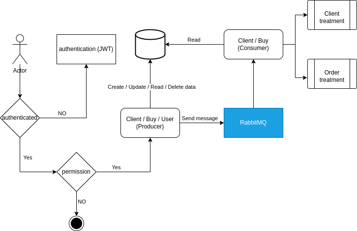
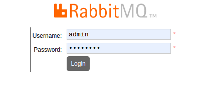
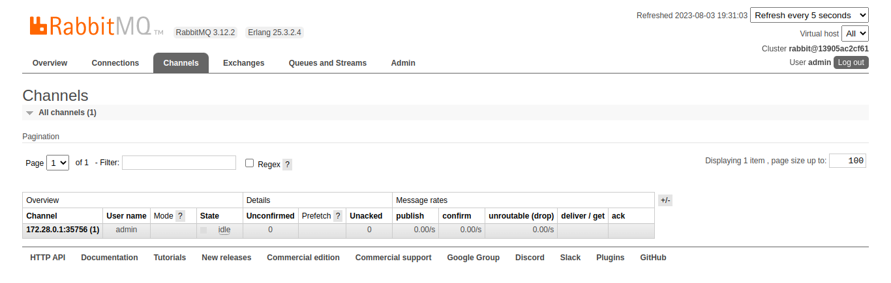
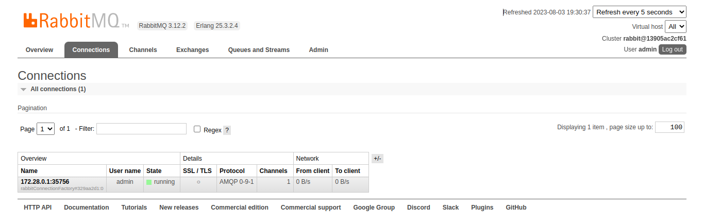
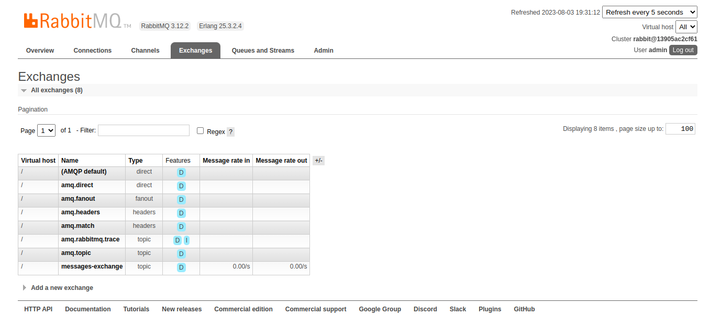
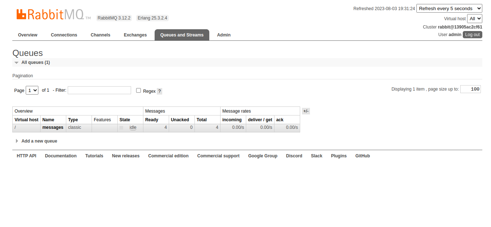
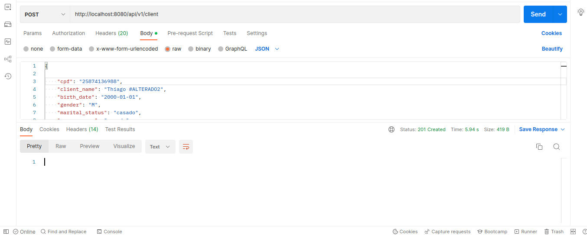
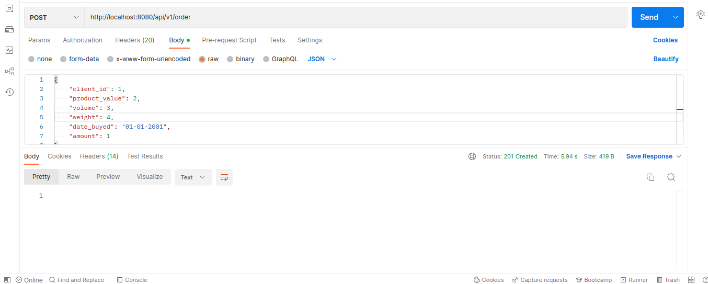
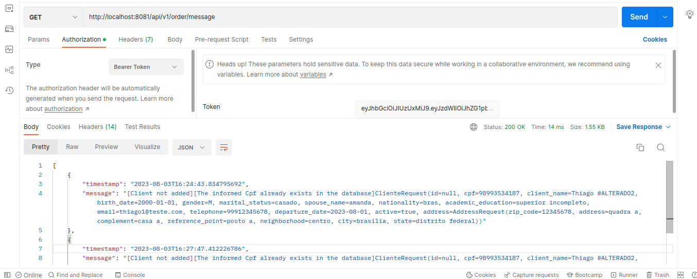

# Technologies / Libraries / Components / Integrations
- Java 17
- Spring Boot 3.0
- Mapper
- JWT
- Security
- Swagger
- Messeger RabittMQ
- Error Handler
- Flyway
- Docker script

# Basic Flow

# Getting Started

### Access each of the folders and follow the startup instructions.
 - Consumer
 - Producer

# -- Sola Gratia --
